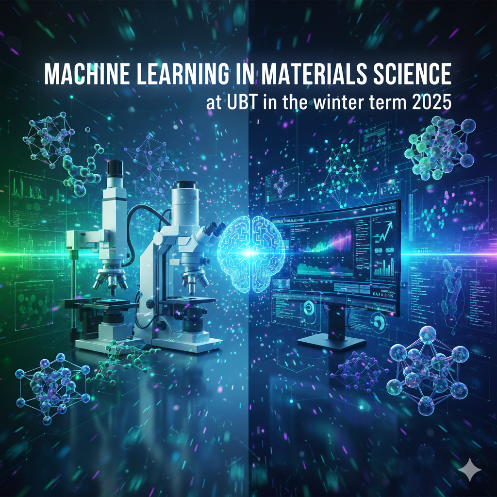

# Machine Learning in Materials Science (MLinMS) - Materials Informatics
   

**Course Exercises - Winter Term 2025**  
**Instructor**: Christopher Kuenneth  
**Computational Materials Science, University of Bayreuth**  

## Overview

Welcome to the exercises for the "Machine Learning in Materials Science" course! Below you'll find relevant instructions, tools, and notes to get started effectively with the coursework.

## Python Dependency Management

This repo utilizes [uv](https://docs.astral.sh/uv/getting-started/installation/) for managing and tracking Python dependencies. Make sure to set up uv to easily manage environments and dependencies for working on the exercises. If you work on Coder, uv is already installed.

## Exercises

The exercises are provided as Jupyter notebooks or Python files.

## Running

You have three options to run the provided Jupyter notebooks:

1. **Coder on Galadriel through VSCode (preferred)**  
   You'll get access to Galadriel through [Coder](https://github.com/coder/coder) during the tutorials and can use it for working on the exercises and your project. Access works through [VSCode](https://code.visualstudio.com/). 

2. **Google Colab**  
   Some notebooks come with a button to launch directly in [Google Colab](https://colab.research.google.com). This is a convenient option if you prefer running notebooks on the cloud.

3. **Locally**  
   Install [VSCode](https://code.visualstudio.com/), Python, and Git.

